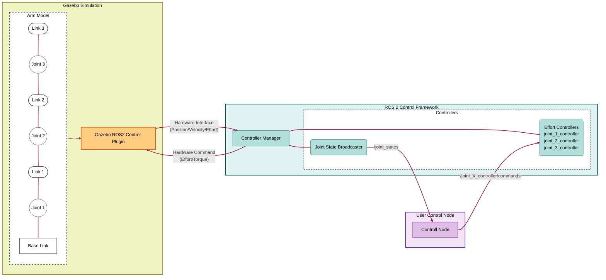

```mermaid
graph LR
    %% Global Graph Settings
    %% Palette: High-Contrast Pastels + Dark Text for maximum readability

    subgraph Gazebo_Simulation ["Gazebo Simulation"]
        style Gazebo_Simulation fill:#f0f4c3,stroke:#827717,stroke-width:2px,color:#000
        
        subgraph Robot_Model ["Arm Model"]
            style Robot_Model fill:#ffffff,stroke:#37474f,stroke-width:2px,stroke-dasharray: 5 5,color:#000
            Base[Base Link]
            J1((Joint 1))
            J2((Joint 2))
            J3((Joint 3))
            L1([Link 1])
            L2([Link 2])
            L3([Link 3])
            
            L3 --- J3 --- L2 --- J2 --- L1 --- J1 --- Base
        end

        Plugin["Gazebo ROS2 Control Plugin"]
        style Plugin fill:#ffcc80,stroke:#e65100,stroke-width:2px,color:#000
        
        Robot_Model -.-> Plugin
    end

    subgraph ROS2_Control ["ROS 2 Control Framework"]
        style ROS2_Control fill:#e0f2f1,stroke:#004d40,stroke-width:2px,color:#000
        
        CM[Controller Manager]
        style CM fill:#b2dfdb,stroke:#00695c,color:#000
        
        subgraph Controllers
            style Controllers fill:#ffffff,stroke:#004d40,stroke-width:1px,stroke-dasharray: 3 3,color:#000
            JSB(Joint State Broadcaster)
            style JSB fill:#b2dfdb,stroke:#00695c,color:#000
            
            Effort("Effort Controllers<br/>joint_1_controller<br/>joint_2_controller<br/>joint_3_controller")
            style Effort fill:#b2dfdb,stroke:#00695c,color:#000
        end
        
        CM --- JSB
        CM --- Effort
    end

    subgraph User_Logic ["User Control Node"]
        style User_Logic fill:#f3e5f5,stroke:#4a148c,stroke-width:2px,color:#000
        Controll["Controll Node"]
        style Controll fill:#e1bee7,stroke:#4a148c,stroke-width:1px,color:#000
    end

    %% Data Flow Connections
    Plugin == "Hardware Interface<br/>(Position/Velocity/Effort)" ==> CM
    CM == "Hardware Command<br/>(Effort/Torque)" ==> Plugin

    JSB -- /joint_states --> Controll
    Controll -- /joint_X_controller/commands --> Effort

    %% Node Styling
    classDef default fill:#fff,stroke:#333,stroke-width:1px,color:#000;

    %% Link (Arrow) Styling - Make them dark and visible
    linkStyle default stroke:#A10C43,stroke-width:2px;
```